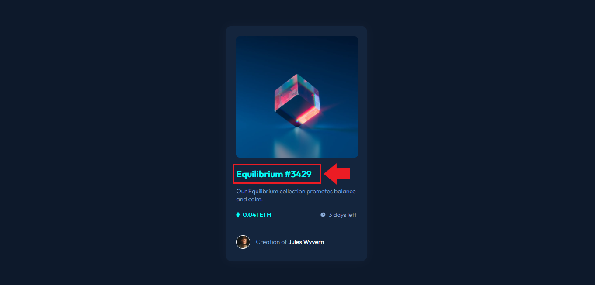
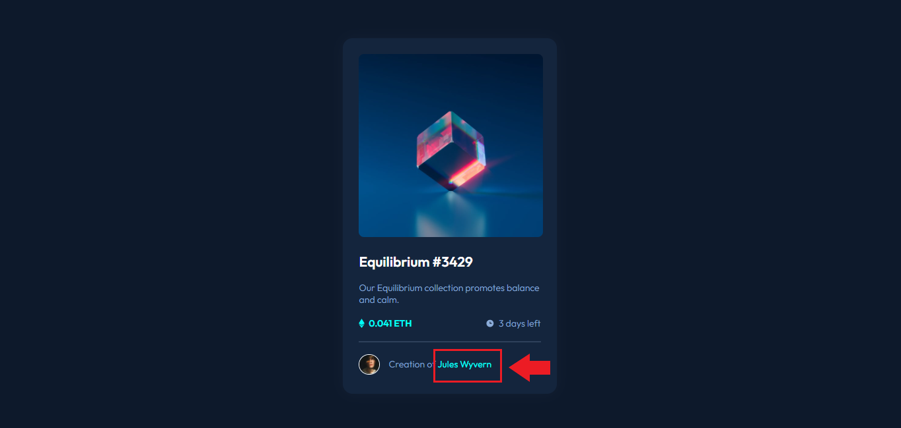

# Frontend Mentor - NFT preview card component solution

This is a solution to the [NFT preview card component challenge on Frontend Mentor](https://www.frontendmentor.io/challenges/nft-preview-card-component-SbdUL_w0U). Frontend Mentor challenges help you improve your coding skills by building realistic projects.

## Table of contents

- [Overview](#overview)
  - [The challenge](#the-challenge)
  - [Solution screenshots](#screenshots)
- [My process](#my-process)
  - [Built with](#built-with)
  - [What I learned](#what-i-learned)
- [Author and contact](#author)

## Overview

### The challenge

Users should be able to:

- View the optimal layout depending on their device's screen size
- See hover states for interactive elements

### Screenshots

I've made some screenshots of my solution.

<figure>
    
    <figcaption>Desktop screenshot.</figcaption>
</figure>

<figure>
    
    <figcaption>Desktop screenshot when I hover image.</figcaption>
</figure>

<figure>
    
    <figcaption>Desktop screenshot when I hover the title.</figcaption>
</figure>

<figure>
    
    <figcaption>Desktop screenshot when I hover the author's name.</figcaption>
</figure>

<figure>
    
    <figcaption>Mobile screenshot.</figcaption>
</figure>

## My process

### Built with

- HTML
- CSS
- Mobile-first workflow

### What I learned

I was able to practice my CSS skills, such as how to positioning elements on the screen, using the box model concept and how to use the `::before` when hover the image, wich was the harderst part of the project.

Here it's how I used the `::before` element when hover the screen:

```css
.container .image::before {
  /*building the element*/
  content: url(../images/icon-view.svg);
  width: 17.38rem; /*278px*/
  height: 17.38rem; /*278px*/
  background: var(--cyan-alternative);
  position: absolute;
  z-index: 1;
  border-radius: 8px;

  /*placing content at center*/
  display: grid;
  place-content: center;

  /*hiding the element*/
  opacity: 0;
  transition: 0.3s;
}

.container .image:hover::before {
  /*when hover, the hiding element shows up*/
  cursor: pointer;
  opacity: 1;
}
```

## Author and contact

- Frontend Mentor - [@KarlaNunes](https://www.frontendmentor.io/profile/KarlaNunes)
- LinkedIn - [Karla Nunes](www.linkedin.com/in/karla-nunes-2873381a0)
